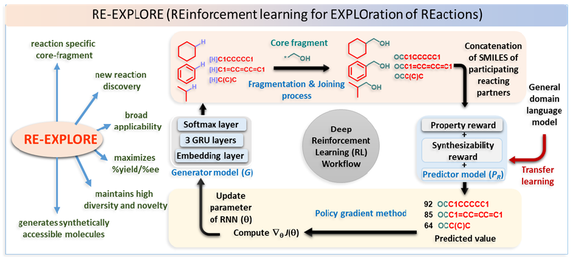

## Overview

In this work, we demonstrate how reward shaping can render a policy gradient reinforcement learning (RL) approach a valuable tool for reaction discovery. Whereas we deploy RL to navigate the generation of novel practical molecules towards higher yield/selectivity regions, yield due to the newly generated molecules is predicted using a transfer learning model.

## Prerequisites
- Python 3.7 (Anaconda)
- PyTorch 1.12.1
- CUDA 11.3

## Environmental Setup

Please clone two existing repository after creating your own environment with python 3.7.16.
```
$ conda create --name REEXPLORE python=3.7.16
$ conda activate REEXPLORE
$ conda install pytorch==1.12.1 torchvision==0.13.1 torchaudio==0.12.1 cudatoolkit=11.3 -c pytorch
$ pip install seaborn
$ pip install scikit-learn
$ pip install tqdm
$ pip install yaml
$ pip install fastprogress
$ pip install spacy
$ pip install PyTDC
$ pip install networkx
$ pip install fcd-torch
```
## Git repository
```
$ https://github.com/fastai/fastai1.git
$ https://github.com/connorcoley/scscore.git
```
## Preparation
We provided our pre-trained model and large datasets in the following link (due to heavy file size)--

## Training RL agent and Surrogate regressor 

