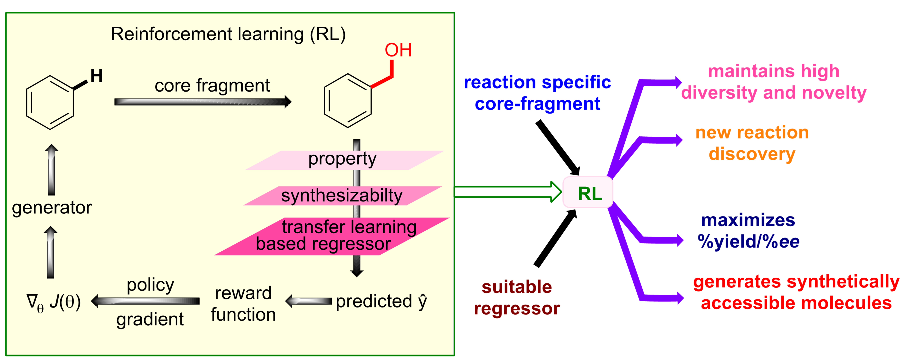

## Overview

In this work, we demonstrate how reward shaping can render a policy gradient reinforcement learning (RL) approach a valuable tool for reaction discovery. Whereas we deploy RL to navigate the generation of novel practical molecules towards higher yield/selectivity regions, yield due to the newly generated molecules is predicted using a transfer learning model.

### Prerequisites
- Python 3.7.16 (Anaconda)
- PyTorch 1.12.1
- CUDA 11.3

### Environmental Setup

```
conda create --name REEXPLORE python=3.7.16
conda activate REEXPLORE
conda install pytorch==1.12.1 torchvision==0.13.1 torchaudio==0.12.1 cudatoolkit=11.3 -c pytorch
pip install seaborn
pip install scikit-learn
pip install tqdm
pip install yaml
pip install fastprogress
pip install spacy
pip install PyTDC
pip install networkx
pip install fcd-torch
```
### Git repository
Please clone two existing repositories (fastai and synthetic complexity score) after creating your environment with Python 3.7.16.
```
https://github.com/fastai/fastai1.git
```
```
https://github.com/connorcoley/scscore.git
```
### Preparation

Our pre-trained models are available in Git LFS format. Additionally, all three datasets used for pre-training can be accessed via the link below:

https://drive.google.com/drive/folders/1n-MfWsh3Y1d_HflR44dVPX1UbHuRq0BK?usp=sharing

Please download the datasets and place them in the `dataset` folder.

## Training
### Pre-training of RL agent 
```
python rl_agent_training.py
```
The default molecular database is ChEMBL.
### Pre-training of surrogate regressor 
```
python regressor_training.py --dataset <type>
```
`<type>` is one of the reaction datasets ['Reaction_a', 'Reaction_b', 'Reaction_c']. The default reaction dataset is ChEMBL

**NB:** *Change the hyper-parameters regarding the datasets like the number of augmented smiles, dropout ratios, etc.*
### Training of RL agent under reaction-tailored reward functionalities
Once you are ready with the trained RL agent and regressor, use the following commands-

Reaction A
```
python Reaction_A_rl_training.py --agent_dataset ChEMBL --trajectories_method random --num_trajectories 4000
```
Reaction B
```
python Reaction_B_rl_training.py --agent_dataset ChEMBL --trajectories_method random --num_trajectories 4000
```
Reaction C
```
python Reaction_C_rl_training.py --agent_dataset ChEMBL --trajectories_method random --num_trajectories 4000
```
where `--agent_dataset` is the molecular database containing the dataset, `--trajectories_method` is one of ['random', 'topp', 'topk'] sampling methods for the molecular generative process, and `--num_trajectories` is the number of trajectories sampled during one episode of RL task.

**NB:** `--core_fragment` may be left out if you don't want to change the core fragment.

### Acknowledgements
We would like to acknowledge the following works, 

https://github.com/Sunojlab/Transfer_Learning_in_Catalysis

https://github.com/skinnider/low-data-generative-models

https://github.com/isayev/ReLeaSE

### Citations
If you found this code/work to be useful, please cite our work 'J. Am. Chem. Soc. 2024, 146, 41, 28250–28267', https://doi.org/10.1021/jacs.4c08866
